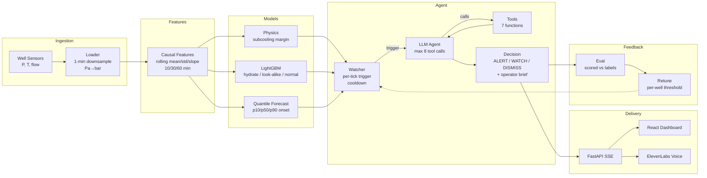

Read context/claude.md for project context and reference reading.

## Current implementation checkpoint

The implemented workflow and commands are in README.md. The current scope is the
existing 31-recording / 21-well 3W subset with causal one-minute processing and
four fixed demo wells: WELL-00001, 00002, 00006 and 00019. Keep the subset and
original files; do not expand to configurable fleets or the full dataset.

The default map uses `frontend/src/FleetDashboard.tsx` and `backend/fleet.py`:
four independent feeds, map above graphs, priority/assessment rail, acknowledgment,
operator observations, targeted telemetry faults, scheduled follow-ups and SSE.
Source timestamps are naive; label them source time, not verified UTC. Map
positions and alignment across separate recordings are illustrative.

`src/fleet_model.py` trains a saved LightGBM bundle on 17 other wells, with every
recording of the four demo wells excluded. Three grouped validation folds select
a threshold/persistence policy before the 11-recording holdout is scored. Run
`python scripts/train_fleet_model.py`; Results reads the resulting measured report.
The selected policy reduces false alarms but delays detection. All four held-out
hydrate recordings are from one well; do not imply four independent hydrate wells.
Labels never enter runtime model/LLM snapshots. Missing or invalid data remains
visible. QGL is gas-lift flow, not an oil-production measurement.

`src/fleet_llm.py` implements bounded OpenRouter tool investigations and structured
assessment validation. The watcher triggers on changed evidence and due rechecks,
with two concurrent investigations and shared account/request bounds. Stale
decisions are rejected. Missing keys/provider failures retain numerical monitoring.
**Live provider verification is pending by user choice.** Mocked integration tests
prove tool orchestration, not external inference. A configured key must not be
labeled a successful live assessment. Never reveal or commit `.env` credentials.

The separate synthetic seed workflow remains under More → Seed sandbox, using
`src/research.py`, `src/live_agent.py` and `backend/live.py`. Its first 10 days
calibrate, next 10 select, and last 10 score; final thresholds refit on days 1–20.
This is separate from the grouped 3W training protocol. The older out-of-fold pilot
also remains available and is not the new model's holdout score.

The broader architecture below is future context. Physics, dosing, forecasting,
vector retrieval, voice and equipment actuation are unimplemented. Keep the
operator interface concise and show evidence on demand. Do not replace measured
results with mocks or turn historical labels into predetermined runtime diagnoses.

---

# Frostline — Project Bible

## Project

Frostline is an agentic hydrate early-warning system for offshore oil wells. IEEE YP Industry Hackathon 2026, Energy & Infrastructure stream, Case 9 (Option B). Submission is a GitHub issue on `nagusubra/industry-hackathon-lab`, hard deadline **Sunday Oct 4, 12:00 PM MDT**.

Judging weights: Autonomous reasoning + data-driven decisions 30%, Real industrial problem 20%, Execution & architecture 20%, Commercialization 15%, Presentation 15%.

Judges want: data in, decision out, one improvement round vs a naive baseline, a live demo, and an architecture diagram.

## Architecture

```
Well sensors (P, T, flow)
  -> clean + downsample to 1 min + causal features
  -> physics (hydrate subcooling margin)
   + ML (LightGBM classifier: hydrate / look-alike / normal;
         quantile forecast of time to onset with 80% range)
  -> watcher (no LLM, per tick, cooldown)
  -> LLM agent calls tools (get_window, hydrate_margin, classify_event,
     forecast_onset, methanol_dose, well_history, search_playbook)
  -> decision ALERT / WATCH(recheck_min) / DISMISS
   + operator brief with evidence
  -> FastAPI SSE -> React dashboard + ElevenLabs voice
  -> outcome scored vs labels
  -> per-well cost-based threshold retune (feedback to watcher)
```



## Data Facts

Verified from petrobras/3W, dataset v2.0.0, CC BY 4.0.

- Folders are class labels: **0** normal, **4** flow instability, **6** quick restriction in PCK, **7** scaling in PCK, **8** hydrate in production line, **9** hydrate in service line.
- Transient (forming) label = class + 100 (108, 109). Steady/established = 8, 9. Some rows have NaN class (unlabelled): drop from training.
- Filenames: `WELL-000XX_<timestamp>.parquet` = real (well id is the prefix), `SIMULATED_*.parquet`, `DRAWN_*.parquet` (training only, never test).
- Counts:
  - Class 8 = 14 real (9 wells: 19, 25, 26, 27, 28, 29, 30, 31, 32) + 81 simulated.
  - Class 9 = 57 real (15 wells, only 14 have transient labels) + 150 simulated.
  - Class 7 = 36 real + 10 drawn.
  - Class 6 = 6 real + 215 simulated.
- 1 Hz sampling, timestamp is the index, pressures in Pa, temperatures in C, all variables Float64, labels Int64.
- Core sensors: `P-PDG`, `T-PDG`, `P-TPT`, `T-TPT`, `P-MON-CKP`, `P-JUS-CKP`, `T-JUS-CKP`, `ABER-CKP`, `QGL`, plus `class`, `state`.
- `T-TPT` exists in 9 of 14 real class 8 files. `T-JUS-CKP` exists in 0 of 14. Missing sensors are normal; agent must handle it.
- Class 8 real forming phases are long (median ~63 h).
- Also bundled: `data/seed/well_hydrate_seed.csv` (synthetic, from the hackathon Case 9 folder) for building the pipeline before 3W is processed.

## Definitions

Everyone uses these exactly:

- **t_form** = first minute of forming phase. **t_est** = first minute of established phase.
- **Alarm** = first minute score >= threshold for 3+ consecutive minutes.
- **Lead time** = t_est - t_alarm (positive = early). Also report vs t_form.
- **Caught** = alarm before t_est. **Late catch** = alarm during established. **Miss** = no alarm.
- **False alarm rate** = alarms during normal operation per 24 h of normal time.
- **Misdiagnosis** = look-alike event flagged as hydrate.
- Systems compared: **B0** always-normal, **B1** 5th-percentile pressure cutoff (matches hackathon `agent_starter.py`), **B2** physics-only (margin > 0), **M1** ML only, **M2** ML + physics, **M3** agent with per-well retuned thresholds.

## Engineering Rules

- All features causal (past data only). Split by well, never by row. Leave-one-well-out on real class 8 wells. Sim-to-real: (a) train sim only, test real; (b) sim + real LOWO.
- Never commit data, models, or `.env`. Repo goes public Sunday.
- LLM never invents numbers: every number in a brief must come from a tool result. Advisory only.
- Each person works on their own branch, merges to main at every checkpoint. Pull main before each session.
- Run your section's tests before merging.

## Team, Ownership, and Tasks

### Data + ML

**Owns:** `src/load.py`, `src/features.py`, `src/model.py`, `tests/test_load.py`, `tests/test_features.py`, `tests/test_model.py`

**Tasks:**
1. Fetch 3W folders 4, 6, 7, 8, 9 + ~100 real files from 0.
2. Loader: 1-min downsample (mean for sensors, mode for class/state), Pa→bar, tag source/well_id/instance_id, derive phase, missing-sensor flags, save one parquet per instance + index.csv, print summary table.
3. Causal rolling mean/std/slope 10/30/60 min, baseline deltas, pressure differentials (P-TPT minus P-MON-CKP, P-PDG minus P-TPT), physics feature hook.
4. LightGBM classifier (normal / hydrate / look-alike) and onset detector, class weights, LOWO, sim-to-real, feature importance.
5. **Handoffs:** predictions file per held-out instance (timestamp, instance_id, well_id, phase, p_hydrate, p_lookalike, p_normal) for Physics+Eval; 3–5 demo replay instances + saved model + `predict(window_df)` for Div; RESULTS.md.

### Physics + Eval

**Owns:** `src/physics.py`, `src/forecast.py`, `eval.py`, `tests/test_physics.py`, `tests/test_forecast.py`, `tests/test_eval.py`

**Tasks:**
1. Unit helpers: Towler-Mokhatab hydrate temperature (verify equation and valid range from the original paper; gas SG param default 0.65; out_of_range flag), subcooling margin from P-TPT/T-TPT (NaN if missing), margin slope, Hammerschmidt dose (K=1297 C, M=32 methanol, 62 MEG; safety margin param default 3 C; flag > ~20–25 wt%).
2. Physics extrapolation onset baseline.
3. LightGBM quantile 0.1/0.5/0.9 onset forecast + coverage check.
4. Eval with the definitions above: systems B0–M3, threshold sweep curves, cost-based threshold picker function for Div, bootstrap CIs, per-event table, `results/summary.csv` + charts, assumptions list for Q&A.
5. **Ship `physics.py` by Sat 10 AM.**

### Div — Agent + Backend

**Owns:** `src/tools.py`, `src/watcher.py`, `src/agent.py`, `src/rag.py`, `backend/`, `tests/test_tools.py`, `tests/test_watcher.py`, `tests/test_agent.py`, `tests/test_rag.py`, `tests/test_api.py`

**Tasks:**
1. API contract (documented below).
2. FastAPI + CORS, replay engine, single SSE stream.
3. Tools with JSON schemas returning compact JSON.
4. Watcher with cooldown and recheck.
5. LLM tool loop: max 8 calls, temperature 0, cache by well+minute, JSON-validated structured decision, retry once then rule-based fallback.
6. Missing-sensor path.
7. Two demo paths: hydrate → ALERT, scaling → DISMISS.
8. RAG over 10–20 cited playbook docs with BM25.
9. Improvement loop using Physics+Eval's threshold picker.
10. Cached demo mode (`?cached=true`).
11. Mentor quote from Discord.

### Dashboard + Presentation

**Owns:** `frontend/`, `POST /tts` route in backend, pitch, submission

**Tasks:**
1. Claim ElevenLabs credits.
2. Vite + React + TS + Recharts + Tailwind, one page.
3. Build against `frontend/mocks` first.
4. Well picker, replay controls, sensor charts with phase shading and alarm line, margin gauge, risk panel with forecast range, agent trace panel, alert card with auto voice, results tab, loading/error states.
5. `/tts` with key in `.env` and audio caching.
6. Wire to real SSE Sat night.
7. Demo mode.
8. Architecture diagram.
9. ~6-slide deck, 5-min script, Q&A prep, backup video.
10. Submission: video, 2–5 screenshots, README, issue form.
11. Bring USB-C to HDMI.

## Checkpoints

- **Tonight:** case confirmed, data downloading, contract drafted.
- **Sat 12 PM:** loader, physics, features done; dashboard on mocks.
- **Sat 4 PM:** end-to-end working (ugly OK).
- **Sat 10 PM:** dashboard on real backend, results final, cached demo saved.
- **Sun 9 AM:** rehearsal + video.
- **Sun 11 AM:** submitted.

## API Contract

### `GET /wells`

Returns a list of available wells/instances.

```json
[
  {
    "well_id": "WELL-00019",
    "instance_id": "WELL-00019_20170101120000",
    "source": "real",
    "sensors_available": ["P-PDG", "T-PDG", "P-TPT", "T-TPT", "P-MON-CKP", "QGL"],
    "has_hydrate_event": true
  }
]
```

### `GET /stream/{instance_id}?speed=60&cached=false`

Server-Sent Events stream. Each event has a `type` field and a `data` JSON payload.

#### Event types

**tick**
```json
{"t": "2024-01-07T06:00:00", "sensors": {"P_TPT_bar": 279.6, "T_TPT_C": 82.3, "P_PDG_bar": 281.2, "T_PDG_C": 83.1, "P_MON_CKP_bar": 278.4, "QGL": 9.95}, "margin_C": 2.1, "p_hydrate": 0.72, "p_lookalike": 0.15, "p_normal": 0.13}
```

**phase_marker**
```json
{"t": "2024-01-07T06:00:00", "phase": "forming"}
```

**watch_trigger**
```json
{"t": "2024-01-07T08:00:00", "reason": "p_hydrate >= 0.6 for 3+ minutes", "score": 0.78}
```

**tool_call**
```json
{"t": "2024-01-07T08:00:00", "call_id": "c1", "tool": "hydrate_margin", "args": {"p_bar": 273.2, "t_c": 82.7}}
```

**tool_result**
```json
{"t": "2024-01-07T08:00:00", "call_id": "c1", "tool": "hydrate_margin", "result": {"margin_C": -1.3, "hydrate_temp_C": 84.0, "status": "danger"}}
```

**decision**
```json
{
  "t": "2024-01-07T08:01:00",
  "decision": "ALERT",
  "recheck_min": null,
  "confidence": 0.85,
  "diagnosis": "hydrate_production_line",
  "onset_eta": {"p10": 45, "p50": 120, "p90": 280},
  "dose_wt_pct": 18.5,
  "dose_in_range": true,
  "evidence": [
    {"tool": "hydrate_margin", "summary": "margin = -1.3 C (danger)"},
    {"tool": "classify_event", "summary": "p_hydrate = 0.78"},
    {"tool": "forecast_onset", "summary": "median 120 min to established"}
  ],
  "playbook_refs": ["hydrate_response_checklist.md"],
  "brief": "Hydrate forming detected on WELL-00019. Subcooling margin is -1.3 C. ML classifier gives 78% hydrate probability. Median time to established phase: 120 min. Recommended methanol dose: 18.5 wt%. Recommend immediate inhibitor injection."
}
```

### `GET /results`

Returns summary evaluation table rows for systems B0–M3.

```json
{
  "systems": [
    {"name": "B0", "description": "Always normal", "caught": 0, "missed": 14, "false_alarms_per_day": 0.0, "mean_lead_time_min": null, "misdiagnosis_rate": 0.0},
    {"name": "B1", "description": "5th-pctl pressure", "caught": 10, "missed": 4, "false_alarms_per_day": 1.2, "mean_lead_time_min": 85.0, "misdiagnosis_rate": 0.0}
  ]
}
```

### `POST /tts`

Request body: `{"text": "Hydrate alert on well 19."}` → Response: `audio/mpeg` binary.

## Hackathon Context

Reference files from the organizers' repo are in `context/hackathon/`. Source: [nagusubra/industry-hackathon-lab](https://github.com/nagusubra/industry-hackathon-lab), commit `c3fa12de`.

### Files

| File | What it is |
|------|-----------|
| [JUDGING_RUBRIC.md](context/hackathon/JUDGING_RUBRIC.md) | Scoring criteria, weights, and what judges look for |
| [RULES.md](context/hackathon/RULES.md) | Team size, submission window, originality, public repo |
| [SUBMISSIONS.md](context/hackathon/SUBMISSIONS.md) | How to submit, editing rules, deadline enforcement |
| [submission.yml](context/hackathon/submission.yml) | GitHub Issue template — the exact form fields |
| [DESIGN-DOC-TEMPLATE.md](context/hackathon/DESIGN-DOC-TEMPLATE.md) | SDD template: intro, system overview, architecture, backend, DB, external APIs, security, frontend, tech stack, testing |
| [case9_README.md](context/hackathon/case9_README.md) | Case 9 challenge description |
| [case9_data_README.md](context/hackathon/case9_data_README.md) | Seed data guide and 3W citation |
| [CASE.md](context/hackathon/CASE.md) | Organizers' example case (scam-text scorer) — shows the style and depth they expect |
| [fullstack-design-doc-tutorial.md](context/hackathon/fullstack-design-doc-tutorial.md) | Filled-in design doc for the example case — shows expected level of detail |
| [fullstack-summary.md](context/hackathon/fullstack-summary.md) | One-page summary of the example project |
| [LICENSE](context/hackathon/LICENSE) | Hackathon repo license |
| [SOURCE.md](context/hackathon/SOURCE.md) | Provenance: repo URL and commit hash |

### What Judges Score (from JUDGING_RUBRIC.md)

- **30% Autonomous reasoning:** Data in → decision out. Show one improvement round vs a baseline (first result vs revised result after the software changed a threshold/weight). Simple diagram of the loop.
- **20% Real industrial problem:** Clear problem statement, real end user (offshore operator), why it matters (lost production, safety). Bonus: mention a mentor/industry conversation.
- **20% Execution & architecture:** Live working demo with real output (not slides). Clear architecture diagram showing data flow. Explain why this design and toolset.
- **15% Commercialization:** Value proposition (who saves money/risk), pilot deployment plan, scalability story.
- **15% Presentation:** Problem → why it matters → approach → live demo → result vs baseline → value. 5-min pitch + 3-min Q&A. Demo is the centerpiece.

### Submission Form Fields (from submission.yml)

1. **Team Name** (required)
2. **Team Members + GitHub handles** (required, 2–5 members)
3. **Project Stream** (required) — "Energy and Infrastructure Systems"
4. **Project Title** (required)
5. **Short Description / Tagline** (required, 3 lines max / ~280 chars)
6. **About the Project** (required) — Inspiration, learnings, how built, challenges. Markdown + LaTeX.
7. **Screenshots** (required) — min 2, max 5 images (PNG/JPG/GIF, 10 MB each)
8. **Demo Video / Live Site Link** (optional but recommended) — YouTube unlisted or Loom
9. **Additional Info** (optional) — Option B Case 9, dataset citations, sponsor tech (ElevenLabs)
10. **Eligibility checkboxes** (required)

**Hard deadline: Sunday Oct 4, 12:00 PM MDT sharp — no exceptions.** Window opens Fri Oct 2 5:00 PM MDT. One issue per team on `nagusubra/industry-hackathon-lab`.

### Case 9 Official Challenge (from case9_README.md)

The organizers' minimum bar: flag the bad hours, beat "always say normal" (B0), move the cutoff once (5th → 10th percentile), and report: events caught, false alarms, and when the rule fails. We go far beyond this with a full agentic pipeline, but the submission must clearly show these basics too.

### Style Notes from the Example Case

The example project (scam-text scorer) shows what organizers consider good:
- **Design doc** follows the SDD template with filled Mermaid diagrams for system context, architecture, data flow, ER schema, and frontend flow.
- **Summary** is a one-page bullet list: purpose, tech stack, design, flow, priorities, security, endpoints, models, evaluation, output, data, frontend flow, testing.
- **Results** are presented as a before/after table (baseline → improved), with per-category breakdown and an honesty section about limitations.
- **System thinking** is valued: stateless vs stateful features, latency budget, feedback loops, adversarial robustness, rollout plan.

We should produce: a filled design doc, an architecture Mermaid diagram, a results table (B0–M3), per-event breakdown, and an honesty/limitations section.

## Commands

```bash
# Setup
python3.11 -m venv .venv
source .venv/bin/activate
pip install -r requirements.txt

# Fetch data
bash scripts/fetch_3w.sh

# Run backend
uvicorn backend.main:app --reload

# Run tests per section
pytest tests/test_load.py tests/test_features.py tests/test_model.py     # Data+ML
pytest tests/test_physics.py tests/test_forecast.py tests/test_eval.py   # Physics+Eval
pytest tests/test_tools.py tests/test_watcher.py tests/test_agent.py tests/test_rag.py tests/test_api.py  # Div

# Run all non-pending tests (CI)
pytest -m "not pending"
```
