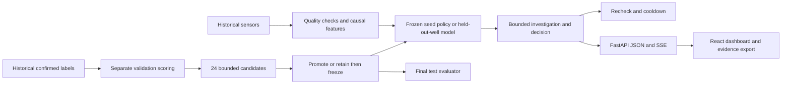

# Frostline · Evidence before confidence

A working Case 9 research prototype for the IEEE YP Industry Hackathon 2026: a live-running sensor agent, autonomous policy selection, measured improvement rounds, and a real-well validation pilot.

## Run the dashboard

Tested locally with Python 3.14 and Node 24. Use Python 3.12+ and Node 22.12+ (Vite 8).

```powershell
python -m venv .venv
.venv/Scripts/python -m pip install -r requirements-research.txt
cd frontend
npm ci
npm run build
cd ..
.venv/Scripts/python -m uvicorn backend.main:app --host 127.0.0.1 --port 8000
```

Open **http://127.0.0.1:8000**. API documentation: **http://127.0.0.1:8000/docs**. No API keys are needed. Fonts and the built UI are served locally. For frontend development, run `npm run dev` in `frontend/` while the API runs on port 8000.

After setup, `./scripts/start_dashboard.ps1` starts the built app in a hidden process and prints its URL. It checks the existing server instead of replacing an unrelated process. Logs are in ignored `logs/`.

## Try the live agent

The default **Live agent** page runs a new backend session. Press **Start mission** at 4× or 8× to watch the full sequence:

1. **Observe:** consume a 52-hour validation window one reading at a time. A quality check runs on each input; anomalies and scheduled rechecks trigger additional tools. The agent decides ALERT, WATCH or DISMISS, then the evaluator reveals the historical label.
2. **Improve:** actually fit and evaluate 24 candidates on the separate calibration/validation periods. Each result shows why it was kept or rejected. Promote only if validation cost improves, refit the selected quantiles on the first 20 days, and freeze the policy.
3. **Prove:** run the frozen policy over all 240 final-test hours. These decisions and scores are computed as inputs arrive.

**Pause** stops further tool execution. **Step** finishes the current reading or evaluates one candidate, then pauses at the next boundary. A browser reload reconnects to the same session and its ordered event journal. Export a run to save every input, tool result, decision, candidate and score.

For a judge interaction, choose **Fault-injection sandbox**. Pause, inject **Sensor offline**, then step: the agent investigates sensor quality and chooses WATCH. Restore input, then inject **Deteriorating conditions** to trigger a confirmed rule and local notification. **Pressure dip** tests corroboration; **Freeze the feed** triggers a quality investigation after six unchanged hourly readings. Injections apply to future inputs. Changed rows and their next five history-dependent rows are excluded from scores; candidate selection always uses untouched historical validation data.

This is a **stateful deterministic controller with conditional tool execution**. No LLM is configured and no field sensor connection is claimed. Notifications stay inside the local demo. Rechecks and cooldown use sensor timestamps; the feed is accelerated historical data. Sessions live in server memory and are cleared on restart; export before restarting if you need the journal. Up to eight sessions can be active at once.

## What is implemented

- **Live agent:** a running backend session, conditional tool calls, pause/resume/step/stop, future-input fault injection, incremental scores, a candidate search and a reconnectable event stream. It does not read prerecorded decisions.
- **Recorded replays:** eight historical replay scenarios after the optional real-data run, sensor charts, playback/seek/speed controls, evaluator-label toggle, decisions and four inspectable evidence steps.
- **Improvement lab:** the official P5 starter, P10 sensitivity, second-sensor confirmation, persistence, EWMA, and bounded automatic selection among 24 policies.
- **Autonomous operating loop:** sensor-quality check → conditional investigation → ALERT / WATCH / DISMISS → scheduled recheck → notification cooldown. Tools execute while the live session advances; normal readings need fewer calls than anomalies.
- **Autonomous improvement loop:** historical validation outcomes score candidates; promote only a strict improvement over the incumbent, refit the chosen quantiles on the first 20 days, freeze, then evaluate the final 10 days.
- **Real-world validation:** a separate three-class LightGBM pilot on Petrobras 3W, with whole wells held out, a confusion matrix, fold audit, and every recording including misses.
- **Research & method:** sources, architecture, provenance, claim boundaries, and a short judge-demo sequence.
- FastAPI JSON and SSE endpoints, result export, and a reproducible CLI.

`CLAUDE.md` and the older modules describe a broader planned architecture. Hydrate thermodynamics, inhibitor dosing, blockage forecasting, LLM tool calling, RAG and voice are **not implemented by this research prototype**. Their original tests remain marked `pending`. The dashboard does not use the hand-authored mock metrics in `frontend/mocks/`.

## Reproduce the seed experiment

```powershell
.venv/Scripts/python eval.py
```

Official synthetic seed: 720 hourly rows over January 2024, with 16 missing pressure values. **Days 1–10 calibrate thresholds; days 11–20 select the rule; days 21–30 are the final test.** Final selected quantiles are refitted on days 1–20 before evaluating the test. The final period has one 12-hour incident and 234 hours with pressure measurements.

| Fixed round | Bad hours caught / 12 | False-alarm hours | Delay after label onset |
|---|---:|---:|---:|
| Always normal | 0 | 0 | No detection |
| Official starter, P5 pressure | 5 | 0 | 7 h |
| P10 pressure | 9 | 7 | 3 h |
| P10 + temperature or flow | 9 | 0 | 3 h |
| Two-hour persistence | 8 | 0 | 4 h |
| Causal EWMA + confirmation | 9 | 0 | 3 h |
| Automatically selected policy | 10 | 0 | 1 h |

The selector considers pressure percentiles `[5,10,15,20]`, confirmation percentiles `[10,20,30]` and persistence `[1,2]` hours. Its objective is **5 × missed bad hours + false-alarm hours**; these are illustrative weights, not validated operating costs. Ties retain the incumbent; candidate ties use false hours, delay, then stable trial order. Winner: P20 pressure + P10 temperature OR flow, one sample. The validation cost improves from 30 to 15. Frozen policy fingerprint: `9ebaabad52ad`.

Missing-pressure hours are excluded equally from baseline comparisons, but kept in the replay as quality warnings and to break persistence. Metrics do not turn a single hit into credit for a whole event. The seed has no forming/established labels: **one hour is detection delay, not early-warning lead time**. One synthetic test incident cannot establish field performance.

## Reproduce the real-well pilot

```powershell
.venv/Scripts/python scripts/fetch_research_data.py
.venv/Scripts/python -m src.real_pilot
```

The first command downloads a bounded real-data subset and records the upstream commit and SHA-256 hashes. It reuses the manifest on subsequent runs. Selection is fixed by filename before training: all real class 8 records, first per well for classes 6/7, and first per well for up to 12 normal wells. This revision has 31 selected recordings from 21 wells. It covers production-line hydrate, normal, quick restriction and scaling; service-line hydrate (9) is outside this pilot.

Protocol: 3-fold GroupKFold by well; fixed LightGBM (80 trees, 15 leaves, balanced classes); causal minute features; missing values retained; pressure converted from Pa to bar. Minute bins are timestamped at their end. No label, well ID, expert state, future interpolation or whole-file frozen-sensor filtering is used as a feature. No hyperparameters or alarm thresholds are tuned on these folds. Alarm: hydrate score ≥0.5 for three minutes with pressure data available.

Observed at 3W revision `6a13bd21a02a2ce6ce23a02b1c2ba2f73770752b`:

- 104,845 labelled minutes; hydrate minute recall **72.8%**; macro F1 **0.457**.
- 12/14 hydrate recordings detected; 10 detections before an established phase. Only 12/14 recordings contain an established phase.
- 1/8 look-alike recordings has a hydrate alarm during its look-alike phase.
- 0.737 false-alarm episodes per normal day.

These are out-of-fold pilot results, not a separate untouched external test. Minutes within a recording are correlated. Class/well and sensor-availability confounding remain possible. The model is a separate system from the synthetic rule: real hydrate can raise upstream pressure while lowering downstream pressure. Model scores are uncalibrated. Real replay display is thinned after per-minute inference, preserving decision and phase transitions; metrics use all minutes.

Artifacts live in ignored `data/raw/research/` and `data/processed/research/`. No downloaded data or trained model is added to Git. Without real artifacts the app still runs the seed experiment and clearly reports the pilot as not run.

## Verification

```powershell
.venv/Scripts/python -m pytest -m "not pending" -p no:cacheprovider -q
cd frontend
npm run build
```

The 65 active tests check official starter parity, final-test isolation, future-input invariance, missing-data gaps, no point-adjusted metrics, promotion/rejection behavior, replay/evaluation consistency, quality fault handling, cooldown, real-well separation, API errors, JSON nulls and SSE completion. Live-session checks cover actual call-before-execution order, pause/step/stop, injection and score exclusion, immutable journal payloads, scheduled rechecks, reconnection cursors, and full-mission parity with the frozen research protocol. The 42 pending tests cover the original, unimplemented extended architecture; they are explicitly excluded, not counted as passing.

## Architecture



## API

| Route | Behavior |
|---|---|
| `GET /api/live/catalog` | Live scenarios and controller/source disclosure |
| `POST /api/live/sessions` | Create a paused mission, sandbox or final-test session |
| `POST /api/live/sessions/{id}/control` | Resume, pause, step, cancel, change speed or inject a fault |
| `GET /api/live/sessions/{id}` | Current state, current-phase readings and recent journal |
| `GET /api/live/sessions/{id}/events?after=0` | Incremental SSE; reconnect using event ID or `Last-Event-ID` |
| `GET /api/live/sessions/{id}/export` | Download the full run journal and measured outcomes |
| `GET /api/research` | Seed experiment plus available real-pilot evidence |
| `GET /api/research/export` | Download the complete report as JSON |
| `POST /api/experiments/run` | Reproduce the frozen seed protocol; no test-tuning controls |
| `GET /api/scenarios` | Replay metadata and provenance |
| `GET /api/scenarios/{id}` | Sensor frames, causal decisions and evaluator-only labels |
| `GET /stream/{id}?start=0&delay_ms=50` | SSE tick, decision and complete events |
| `GET /api/health` | Local service and real-pilot availability |
| `GET /results`, `GET /wells` | Research report and replay catalog aliases |
| `POST /tts` | Explicit 503: optional voice is not configured |

## Research and attribution

- [Official Case 9](https://github.com/nagusubra/industry-hackathon-lab/tree/main/01-energy-and-infrastructure-systems/Case%209%20-%20Autonomous%20Offshore%20Well%20Event%20Flag%20Agent) and [judging rubric](https://github.com/nagusubra/industry-hackathon-lab/blob/main/JUDGING_RUBRIC.md).
- [Petrobras 3W](https://github.com/petrobras/3W), **CC BY 4.0**. The local pilot resamples recordings and derives features; original authors retain attribution. [Dataset paper](https://arxiv.org/html/2507.01048v1).
- [Threshold selection on separate data](https://scikit-learn.org/stable/modules/classification_threshold.html), [GroupKFold](https://scikit-learn.org/stable/modules/generated/sklearn.model_selection.GroupKFold.html), [NIST EWMA](https://www.itl.nist.gov/div898/handbook/pmc/section3/pmc324.htm), [anomaly-evaluation pitfalls](https://arxiv.org/abs/2109.05257).
