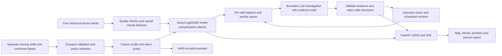

# Frostline · Evidence before confidence

A Case 9 prototype for offshore operators: four independent Petrobras 3W sensor replays, a trained event model, a priority queue and an agent that investigates changing evidence. The interface keeps the map, trends and next operator action together.

**Current verification:** numerical monitoring and the complete operator workflow run locally. The LLM tool loop is tested with simulated provider responses; genuine OpenRouter inference is **pending** until a local key is configured. No production sensor connection or equipment control is claimed.

## Run the dashboard

Tested locally with Python 3.14 and Node 24. Use Python 3.12+ and Node 22.12+ (Vite 8).

```powershell
python -m venv .venv
.venv/Scripts/python -m pip install -r requirements-research.txt
.venv/Scripts/python scripts/fetch_research_data.py
.venv/Scripts/python scripts/train_fleet_model.py
cd frontend
npm ci
npm run build
cd ..
.venv/Scripts/python -m uvicorn backend.main:app --host 127.0.0.1 --port 8000
```

Open **http://127.0.0.1:8000**. API documentation: **http://127.0.0.1:8000/docs**. Numerical monitoring needs no API key. Fonts and the built UI are served locally. For frontend development, run `npm run dev` in `frontend/` while the API runs on port 8000.

After setup, `./scripts/start_dashboard.ps1` starts the built app in a hidden process and prints its URL. It checks the existing server instead of replacing an unrelated process. Logs are in ignored `logs/`.

## Four-well operator demo

1. Press **Start field replay**. At 60×, each second advances one source minute for all four wells. The full excerpt lasts three source hours. Negative chart minutes show the preceding history.
2. Select any well on the map or priority list. Its actual pressure, temperature, model score, sensor quality and next action update together. The map is illustrative; the recordings come from different dates and are aligned only for the demo.
3. Watch **Well 19** move from normal to watch, then needs review at approximately minute 35. This is computed from the incoming measurements. The agent never receives the historical event labels.
4. **Acknowledge** the incident, then **Add observation**. Neither action clears the measured concern. An observation triggers reassessment and remains a human report, not a training label.
5. Pause and try a **telemetry fault** on Well 1. Step once: its pressure evidence becomes unavailable while the other wells retain their own readings. The injected fault lasts five new readings unless restored early. It does not change the model benchmark.
6. Open **Evidence** for sensor availability, provenance and tool history; open **Results** for the measured improvement rounds. Export the run for its full event journal.

**Start** creates a new run. **Pause** stops new readings and investigations; an already running provider request may finish. **Step** consumes one new minute and stays paused; queued investigations run after **Resume**. **Resume** continues the same history and incidents. Reloading the browser reconnects; restarting the server clears its in-memory sessions. Export before restarting. Four sessions may run concurrently; eight recent sessions are retained.

### What makes it autonomous

Every minute, quality checks sanitize sensors and a fixed LightGBM model scores normal, hydrate and restriction/scaling patterns using only observed history. A watcher checks persistence and pressure changes. Changed evidence or a due follow-up puts a well into the investigation queue. Normal operation does not call an LLM every tick.

With `OPENROUTER_API_KEY` in the ignored root `.env`, the agent can choose evidence tools for recent readings, sensor quality, model evidence, pressure comparisons, prior assessments, fleet priorities and project guidance. It must return a validated assessment, cited evidence, an operator action and a recheck interval. Unsupported escalation, invented numerical claims, stale decisions and unapproved actions are rejected. Observations cannot instruct the agent to bypass these checks. No fine-tuning of the LLM occurs: its improvement here comes from better evidence and a better validated numerical policy.

Provider work is bounded to two simultaneous investigations across sessions, ten outbound attempts per minute, eighteen attempts per run, and three attempts per investigation. Only the explicit free-model allowlist is accepted. Account limits pause requests across wells; a reported nonzero charge disables further calls until restart. Missing keys, exhausted budgets and provider failures retain numerical monitoring and visibly label the assessment **Model + rules**. A configured key alone never counts as a verified live assessment.

### What data we use and what gets trained

The existing subset contains **31 recordings from 21 wells**. It has timestamped pressure, temperature, choke opening and gas-lift flow channels, with missing values and event annotations. Pressure is converted from Pa to bar; temperature remains °C; `QGL` is gas-lift flow, not oil production. The original files remain unchanged. Causal one-minute bins preserve missing intervals and exclude invalid sentinel values. There is no future interpolation.

Four fixed wells are shown in the demo: **00001, 00002, 00006 and 00019**. Their source recordings cover normal operation, restriction, scaling and hydrate respectively. These labels describe the dataset for evaluation; the app does not assign those diagnoses in advance. The present model does not reliably identify every restriction/scaling recording. Well 6 often appears as a sensor-quality concern.

All recordings from those four wells are excluded from training. The model trains on **20 recordings from 17 other wells**; three grouped validation folds choose among 15 threshold/persistence policies. The final frozen model is evaluated on **11 recordings from the four excluded wells**. The selected policy requires score ≥0.70 for five usable minutes; recovery needs five minutes below 0.60. These are model scores, not calibrated probabilities.

The separate official seed experiment still uses **days 1–10 for calibration, 11–20 for selection, 21–30 for final scoring**. Its 20/10-day split does not describe the multi-well 3W protocol.

### Measured improvement and limits

`scripts/train_fleet_model.py` saves `models/fleet_model.pkl` and `data/processed/research/fleet_report.json`. Results reads that report, including every accepted/rejected candidate and per-recording outcome.

| Stage on the held-out 3W recordings | False-alarm episodes | False-alarm minutes | Hydrate recordings detected |
|---|---:|---:|---:|
| Raw model, fixed policy | 11 | 2,444 | 4 / 4 |
| Quality checks, fixed policy | 9 | 2,400 | 4 / 4 |
| Validation-selected policy | 6 | 2,263 | 4 / 4 |

Selection happened on the other wells: validation detection stayed at 9/10 recordings while false-alarm episodes fell from 7 to 4. On the four excluded wells, lower false alarms came with slower mean detection (3.75→8.75 minutes) and lower hydrate-minute recall (93.36%→90.08%) versus the quality-checked fixed policy. The four detected hydrate recordings all belong to **one held-out well**. False-alarm burden is still high (about 403 minutes per normal day). This subset was explored previously, so the result is internal held-out-well evaluation, not untouched external validation. These results justify further validation, not a production-readiness claim. LLM/operator decisions have not been scored as a further detection improvement.

## Separate seed baseline and improvement demo

**More → Seed sandbox** retains the original synthetic, single-well workflow. Its demo controls and advanced diagnostics show the full journal and the 24-candidate policy search.

Choose **Full demo** in Demo controls and press **Start demo** at 4× or 8× to watch the full sequence:

1. **Observe:** consume a 52-hour validation window one reading at a time. A quality check runs on each input; anomalies and scheduled rechecks trigger additional tools. The agent decides ALERT, WATCH or DISMISS, then the evaluator reveals the historical label.
2. **Improve:** actually fit and evaluate 24 candidates on the separate calibration/validation periods. Each result shows why it was kept or rejected. Promote only if validation cost improves, refit the selected quantiles on the first 20 days, and freeze the policy.
3. **Prove:** run the frozen policy over all 240 final-test hours. These decisions and scores are computed as inputs arrive.

**Pause** stops further tool execution. **Step** finishes the current reading or evaluates one candidate, then pauses at the next boundary. A browser reload reconnects to the same session and its ordered event journal. Export a run to save every input, tool result, decision, candidate and score.

For a judge interaction, choose **Fault sandbox** in Demo controls. Pause, inject **Sensor outage**, then step: the agent investigates sensor quality and chooses WATCH. Restore input, then inject **Deterioration** to trigger a confirmed rule and local notification. **Pressure drop** tests corroboration; **Frozen readings** triggers a quality investigation after six unchanged hourly readings. Injections apply to future inputs. Changed rows and their next five history-dependent rows are excluded from scores; candidate selection always uses untouched historical validation data.

This separate seed workflow is a **stateful deterministic controller with conditional tool execution**. Notifications stay inside the local demo. Rechecks and cooldown use source timestamps. It does not call the fleet LLM adapter.

## What is implemented

- **Well map:** four independent real-data feeds, a map above trends, a priority/assessment rail, acknowledgment, observations and bounded investigations. Narrow screens put the next action before the graphs.
- **Recorded replays:** eight historical replay scenarios after the optional real-data run, sensor charts, playback/seek/speed controls, evaluator-label toggle, decisions and four inspectable evidence steps.
- **Improvement lab:** the official P5 starter, P10 sensitivity, second-sensor confirmation, persistence, EWMA, and bounded automatic selection among 24 policies.
- **Seed operating loop:** sensor-quality check → conditional investigation → ALERT / WATCH / DISMISS → scheduled recheck → notification cooldown. Tools execute while the live session advances; normal readings need fewer calls than anomalies.
- **Seed improvement loop:** historical validation outcomes score candidates; promote only a strict improvement over the incumbent, refit the chosen quantiles on the first 20 days, freeze, then evaluate the final 10 days.
- **Real-world validation:** a separate three-class LightGBM pilot on Petrobras 3W, with whole wells held out, a confusion matrix, fold audit, and every recording including misses.
- **Research & method:** sources, architecture, provenance, claim boundaries, and a short judge-demo sequence.
- FastAPI JSON and SSE endpoints, result export, and a reproducible CLI.

`CLAUDE.md` and older modules also describe a broader planned architecture. Hydrate thermodynamics, inhibitor dosing, blockage forecasting, vector retrieval and voice remain **unimplemented**. Their original tests remain marked `pending`. The fleet has its own implemented LLM tool loop and small project-guidance search. The dashboard does not use the hand-authored metrics in `frontend/mocks/`.

## Reproduce the seed experiment

```powershell
.venv/Scripts/python eval.py
```

Official synthetic seed: 720 hourly rows over January 2024, with 16 missing pressure values. **Days 1–10 calibrate thresholds; days 11–20 select the rule; days 21–30 are the final test.** Final selected quantiles are refitted on days 1–20 before evaluating the test. The final period has one 12-hour incident and 234 hours with pressure measurements.

| Fixed round | Bad hours caught / 12 | False-alarm hours | Delay after label onset |
|---|---:|---:|---:|
| Always normal | 0 | 0 | No detection |
| Official starter, P5 pressure | 5 | 0 | 7 h |
| P10 pressure | 9 | 7 | 3 h |
| P10 + temperature or flow | 9 | 0 | 3 h |
| Two-hour persistence | 8 | 0 | 4 h |
| Causal EWMA + confirmation | 9 | 0 | 3 h |
| Automatically selected policy | 10 | 0 | 1 h |

The selector considers pressure percentiles `[5,10,15,20]`, confirmation percentiles `[10,20,30]` and persistence `[1,2]` hours. Its objective is **5 × missed bad hours + false-alarm hours**; these are illustrative weights, not validated operating costs. Ties retain the incumbent; candidate ties use false hours, delay, then stable trial order. Winner: P20 pressure + P10 temperature OR flow, one sample. The validation cost improves from 30 to 15. Frozen policy fingerprint: `9ebaabad52ad`.

Missing-pressure hours are excluded equally from baseline comparisons, but kept in the replay as quality warnings and to break persistence. Metrics do not turn a single hit into credit for a whole event. The seed has no forming/established labels: **one hour is detection delay, not early-warning lead time**. One synthetic test incident cannot establish field performance.

## Reproduce the real-well pilot

```powershell
.venv/Scripts/python scripts/fetch_research_data.py
.venv/Scripts/python -m src.real_pilot
```

The first command downloads a bounded real-data subset and records the upstream commit and SHA-256 hashes. It reuses the manifest on subsequent runs. Selection is fixed by filename before training: all real class 8 records, first per well for classes 6/7, and first per well for up to 12 normal wells. This revision has 31 selected recordings from 21 wells. It covers production-line hydrate, normal, quick restriction and scaling; service-line hydrate (9) is outside this pilot.

Protocol: 3-fold GroupKFold by well; fixed LightGBM (80 trees, 15 leaves, balanced classes); causal minute features; missing values retained; pressure converted from Pa to bar. Minute bins are timestamped at their end. No label, well ID, expert state, future interpolation or whole-file frozen-sensor filtering is used as a feature. No hyperparameters or alarm thresholds are tuned on these folds. Alarm: hydrate score ≥0.5 for three minutes with pressure data available.

Observed at 3W revision `6a13bd21a02a2ce6ce23a02b1c2ba2f73770752b`:

- 104,845 labelled minutes; hydrate minute recall **72.8%**; macro F1 **0.457**.
- 12/14 hydrate recordings detected; 10 detections before an established phase. Only 12/14 recordings contain an established phase.
- 1/8 look-alike recordings has a hydrate alarm during its look-alike phase.
- 0.737 false-alarm episodes per normal day.

These are out-of-fold pilot results, not a separate untouched external test. Minutes within a recording are correlated. Class/well and sensor-availability confounding remain possible. The model is a separate system from the synthetic rule: real hydrate can raise upstream pressure while lowering downstream pressure. Model scores are uncalibrated. Real replay display is thinned after per-minute inference, preserving decision and phase transitions; metrics use all minutes.

Artifacts live in ignored `data/raw/research/` and `data/processed/research/`. No downloaded data or trained model is added to Git. Without real artifacts the app still runs the seed experiment and clearly reports the pilot as not run.

## Verification

```powershell
.venv/Scripts/python -m pytest -m "not pending" -p no:cacheprovider -q
cd frontend
npm run build
```

Tests cover starter parity, held-out-well isolation, future-input invariance, minute/stream feature parity, model promotion, missing-data gaps, alert recovery, per-well fault isolation, scheduled rechecks, stale-response rejection, quotas, reconnection/export and API validation. Mocked provider tests exercise adaptive multi-round tools, schema validation, injection resistance, numerical escalation checks and failure handling. They do not prove live-provider behavior. The 42 pending tests cover the original unimplemented extended architecture and are excluded, not counted as passing.

## Architecture



## API

| Route | Behavior |
|---|---|
| `GET /api/fleet/catalog` | Four fixed wells, model readiness and key configuration |
| `POST /api/fleet/sessions` | Start a four-well replay at 30×, 60× or 120× |
| `GET /api/fleet/sessions/{id}` | Latest field state and per-well evidence |
| `POST /api/fleet/sessions/{id}/control` | Pause, resume, step, restart via new session, speed and targeted fault |
| `POST /api/fleet/sessions/{id}/incidents/{well}/actions` | Acknowledge, report observation or complete an operator review |
| `GET /api/fleet/sessions/{id}/events` | Ordered SSE snapshots and reconnection cursors |
| `GET /api/fleet/sessions/{id}/export` | Complete source/decision/operator journal |
| `GET /api/fleet/results` | Frozen model protocol, selection rounds and measured holdout results |
| `GET /api/live/catalog` | Live scenarios and controller/source disclosure |
| `POST /api/live/sessions` | Create a paused mission, sandbox or final-test session |
| `POST /api/live/sessions/{id}/control` | Resume, pause, step, cancel, change speed or inject a fault |
| `GET /api/live/sessions/{id}` | Current state, current-phase readings and recent journal |
| `GET /api/live/sessions/{id}/events?after=0` | Incremental SSE; reconnect using event ID or `Last-Event-ID` |
| `GET /api/live/sessions/{id}/export` | Download the full run journal and measured outcomes |
| `GET /api/research` | Seed experiment plus available real-pilot evidence |
| `GET /api/research/export` | Download the complete report as JSON |
| `POST /api/experiments/run` | Reproduce the frozen seed protocol; no test-tuning controls |
| `GET /api/scenarios` | Replay metadata and provenance |
| `GET /api/scenarios/{id}` | Sensor frames, causal decisions and evaluator-only labels |
| `GET /stream/{id}?start=0&delay_ms=50` | SSE tick, decision and complete events |
| `GET /api/health` | Local service and real-pilot availability |
| `GET /results`, `GET /wells` | Research report and replay catalog aliases |
| `POST /tts` | Explicit 503: optional voice is not configured |

## Five-minute judge walkthrough

- **0:00–0:35 — User/problem:** an operator needs to know which well to inspect first, with enough evidence to act without reading every chart.
- **0:35–1:15 — Architecture:** explain sensors → quality/model → watcher → evidence tools → priority/action/recheck. Show the diagram above.
- **1:15–2:45 — Working demo:** run the four feeds, select Well 19, show the changing score and persistent alert, acknowledge it, and show that monitoring continues. Inject a pressure outage on a different well to demonstrate isolation and uncertainty handling.
- **2:45–4:10 — Improvement:** show Results. Explain baseline → quality checks → validation-selected threshold/persistence, including the delay/false-alarm tradeoff. The seed baseline offers the official 20/10-day comparison separately.
- **4:10–5:00 — Value and next pilot:** propose read-only shadow monitoring for one operator team, measure review time and unnecessary escalations, collect adjudicated outcomes, and then validate across more hydrate wells. More wells would use partitioned feed workers plus a shared priority/provider queue; this prototype demonstrates four, not production scale. Do not claim savings or mentor validation that have not been measured.

For a network-independent demo, leave provider mode visibly **Model + rules** and show the numerical loop plus saved results. Capture the dashboard and export a run before presentation. Before claiming an LLM demonstration, add the key and verify an actual provider response, tool history, validated assessment and request usage. A short mentor/operator conversation is still a team action: confirm the next-action wording and which false alarms are most disruptive.

## Research and attribution

- [Official Case 9](https://github.com/nagusubra/industry-hackathon-lab/tree/main/01-energy-and-infrastructure-systems/Case%209%20-%20Autonomous%20Offshore%20Well%20Event%20Flag%20Agent) and [judging rubric](https://github.com/nagusubra/industry-hackathon-lab/blob/main/JUDGING_RUBRIC.md).
- [Petrobras 3W](https://github.com/petrobras/3W), **CC BY 4.0**. The local pilot resamples recordings and derives features; original authors retain attribution. [Dataset paper](https://arxiv.org/html/2507.01048v1).
- [Threshold selection on separate data](https://scikit-learn.org/stable/modules/classification_threshold.html), [GroupKFold](https://scikit-learn.org/stable/modules/generated/sklearn.model_selection.GroupKFold.html), [NIST EWMA](https://www.itl.nist.gov/div898/handbook/pmc/section3/pmc324.htm), [anomaly-evaluation pitfalls](https://arxiv.org/abs/2109.05257).
