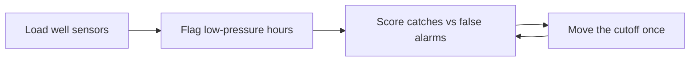

# Case 9 - Which wells need help right now?

**Stream:** Energy and Infrastructure Systems  
**Event:** IEEE YP Industry Hackathon  
**Dates:** October 2–4, 2026 | Collision Space, Hunter Hub, University of Calgary

---

## The problem (in plain words)

An offshore oil well pushes oil up with pressure. Sometimes ice-like crystals called **hydrates** clog the pipe. Pressure falls, flow chokes, and if nobody acts the well can shut down or break. Lost production from these events can reach **5%** of output.

Operators watch pressure charts all day. Your job is simpler: write a rule that reads the sensor numbers once an hour and says **normal** or **needs help**.

**Your challenge:** Flag the bad hours. Beat “always say normal.” Then **move the cutoff once** and show whether you catch more events or just cry wolf more.

---

## Who would use this

An offshore production engineer or control-room operator. You are selling **an early warning** so one crew checks the right well first.

---

## Steps

1. Load the well file. Drop rows with missing pressure. Say how many.
2. Split by time: first 20 days to pick the rule, last 10 days to score it.
3. Call an hour “needs help” in one sentence (example: pressure below the 5th percentile of training).
4. Score caught events vs false alarms against always-normal. Move the cutoff once (5th to 10th percentile) and score again.
5. Write three sentences: events caught, false alarms, when the rule would fail.

---

## Picture of the loop

**Always-normal** means you never raise an alarm. It looks accurate because bad hours are rare - but it catches nothing.

---

## New words

| Word | Meaning |
|---|---|
| Hydrate | Ice-like crystals that clog a subsea pipe and choke flow |
| Baseline | The simple plan you must beat (here: always say normal) |
| False alarm | Flagging a healthy hour as needing help |

---

## Watch or read (optional)

- [Petrobras 3W Dataset (real offshore well events)](https://github.com/petrobras/3W)
- [Hydrate plug - why it matters (short explainer)](https://en.wikipedia.org/wiki/Clathrate_hydrate)
- [Precision and recall in one picture](https://en.wikipedia.org/wiki/Precision_and_recall)

---

## Start here

1. Open a terminal **in this folder**.
2. `pip install -r requirements.txt`
3. `python agent_starter.py`
4. Change `PCTL` from 5 to 10 and run it again.

Data notes: [`data/README.md`](data/README.md). **Python 3.10+** (3.11 is best).
